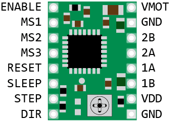
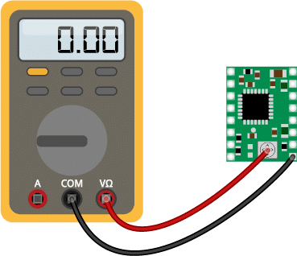
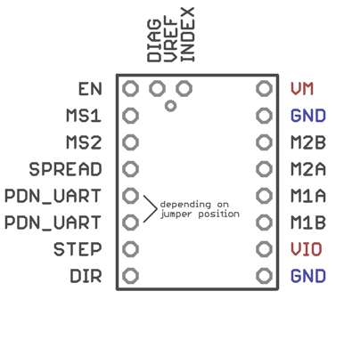

Serial set to 115200
webadress: astrolite.local

Behaviour:

On turning on the motor is powered off. 
Tracking can be engaged via an on/off switch. The motor holds steadily when the tracking is off. 
A "Motor off" button cuts power to the motor entirely. 

The motor can be moved quickly in discrete steps. 
A STOP button disengages both the movement and the tracking. 

The settings panel allows to set a few parameters:
- LED and startup tone are not implemented yet.
- hold between steps is default, and should be removed
- sleep periods also
Calibration can be set here as N steps / a full rotation
Wifi credentials can also be set to connect to a nearby network. 
If such a network is not available, the device sets up its own access point. 

Step counter is a device helping with the calibration. 
It can conveniently perform an arbitrary number of steps quickly, 
and this way an arc of known angle can be covered while the steps are counted. 
-------------------------

https://www.airspayce.com/mikem/arduino/AccelStepper/classAccelStepper.html#a3591e29a236e2935afd7f64ff6c22006

The fastest motor speed that can be reliably supported is about 4000 steps per second at a clock frequency of 16 MHz on Arduino such as Uno etc. Faster processors can support faster stepping speeds. However, any speed less than that down to very slow speeds (much less than one per second) are also supported, provided the run() function is called frequently enough to step the motor whenever required for the speed set. Calling setAcceleration() is expensive, since it requires a square root to be 

ESP8266 (80 or 160 MHz), 1 core 
ESP32: (160 or 240 MHz), 2 cores
https://community.platformio.org/t/setting-cpu-frequency/26760/20
https://community.platformio.org/t/esp32-board-build-f-cpu-does-nothing/5480/7
does anybody know, if setting CPU clock at runtime, is even possible on the ESP32 (like it is on ESP8266)?
No, this isn't possible on the ESP32.

## How to determine the correct stepper motor wiring?

If you can’t find the datasheet of your stepper motor, it can be difficult to figure out how to wire your motor correctly. I use the following trick to determine how to connect 4 wire bipolar stepper motors:

The only thing you need to identify is the two pairs of wires which are connected to the two coils of the motor. The wires from one coil get connected to 1A and 1B and the other to 2A and 2B, the polarity doesn’t matter.

To find the two wires from one coil, do the following with the motor disconnected:

    Try to spin the shaft of the stepper motor by hand and notice how hard it is to turn.
    Now pick a random pair of wires from the motor and touch the bare ends together.
    Next, try to spin the shaft of the stepper motor again.

If you feel a lot of resistance, you have found a pair of wires from the same coil. If you can spin the shaft freely, try another pair of wires. Now connect the two coils to the pins shown in the wiring diagram above.

## HW-134 A4988 stepper motor driver

https://www.makerguides.com/a4988-stepper-motor-driver-arduino-tutorial/

Stepper motors typically have a step size of 1.8° or 200 steps per revolution, this refers to full steps. A microstepping driver such as the A4988 allows higher resolutions by allowing intermediate step locations. This is achieved by energizing the coils with intermediate current levels.

For instance, driving a motor in quarter-step mode will give the 200-step-per-revolution motor 800 microsteps per revolution by using four different current levels.

The resolution (step size) selector pins (MS1, MS2, and MS3) allow you to select one of the five step resolutions according to the table below.

|MS1	| MS2 |	 MS3  |	    Microstep resolution |
|-------|-----|--|--|
|Low	| Low |	 Low  |	    Full step |
|High	| Low |	 Low  |	    1/2  step |
|Low	| High | Low  |	    1/4  step |
|High	| High | Low  |	    1/8  step |
|High	| High | High  |	1/16 step |

All three inputs have internal 100 kΩ pull-down resistors, so leaving the three microstep selection pins disconnected results in full-step mode.

| A4988 | Connections |
|-------|-------------|
| A4988	| Connection  |
| VMOT	| 8-35V       |
| GND	| Motor ground|
| SLP	|     RESET   |
| RST	|     SLP     |
| VDD	|     5V
| GND	|     Logic ground  |
| STP	|     Pin 3         |
| DIR	|     Pin 2         | 
| 1A, 1B, 2A, 2B	| Stepper motor |

The A4988 carrier board uses low-ESR ceramic capacitors, which makes it susceptible to destructive LC voltage spikes, especially when using power leads longer than a few inches.

To protect the driver you can connect an **electrolytic capacitor between VMOT and GND**. Pololu suggests a capacitor of 47 µF or more (I used a 100 µF capacitor).

### How to set the current limit?

Before you start programming your Arduino and start using the driver there is one very important thing you need to do that a lot of people forget: set the current limit!

This step is not very complicated but absolutely necessary to protect your stepper motor and the driver. If you do not set an appropriate current limit, your motor can draw more current than it or your driver can handle, this is likely to damage one or both of them.

To set the current limit you need to measure a reference voltage and adjust the on-board potentiometer accordingly. You will need a small scr
To measure the reference voltage, the driver needs to be powered. The A4988 only needs power via VDD (5V) and you need to connect RST and SLP together, otherwise the driver won’t turn on. It’s best to disconnect the stepper motor while you do this.

If you have already wired up the driver, you can leave everything but the stepper motor connected. You can apply power through the USB port of the Arduino.

The next step is to calculate the current limit with the following formula:

Current Limit = Vref ÷ (8 × Rcs)

The Rcs is the current sense resistance. If you bought a A4988 driver from Pololu before January 2017, the Rcs will be 0.050 Ω. Drivers sold after that have 0.068 Ω current sense resistors.

So this means that for a current limit of 1A for a board with 0.068 Ω current sense resistors, the Vref should be 540 mV.

To select the right current limit, take a look at the datasheet of your stepper motor. If you can’t find the current rating of your motor, I recommend starting with a current limit of 1A. You can always increase it later if your motor/driver is missing steps.

When using the driver in full-step mode, the current through each coil is limited to approximately 70% of the set current limit. This means that you would need to set the current limit 40% higher or 1.4 A in full-step mode. When using microstepping, the formula above applies.

Note that you need to re-calibrate the current limit if you change the motor power supply voltage. If your motor is making a lot of noise, try to lower the current limit. It’s best to set the current limit just high enough so the motor doesn’t miss steps.

#### Measuring Vref

Now you will need to measure the reference voltage (Vref) between the two points marked on the picture below (GND and the potentiometer) and adjust it to the value you calculated.
A4988 Current limit probe pointsVref probe points (GND and potentiometer).

I recommend using alligator test leads clamped to the screwdriver to set the current limit. This allows you to adjust the potentiometer and measure the reference voltage at the same time.

Note: There is another way to measure the current limit and that is to directly measure the current draw of the stepper motor. Personally I find the above method a lot easier.

## TMC2209 stepper motor driver
The TMC2209 is an ultra-silent motor driver IC for two phase stepper motors with both UART serial and step and direction interfaces. 

| CFG2/MS2	| CFG1/MS1 |	SPREAD/MS3 |	Steps	|Interpolation |	Mode |
|---|---|---|---|---|-|
| GND |	GND |	GND|	1/8 |	1/256 |	stealthChop |
| GND |	VIO |	GND|	1/32 |	1/256 |	stealthChop |
| VIO |	GND |	GND|	1/64 |	1/256 |	stealthChop |
| VIO |	VIO |	GND|	1/16 |	1/256 |	stealthChop |
| GND |	GND |	VIO|	1/8 |	1/256 |	spreadCycle |
| GND |	VIO |	VIO|	1/32 |	1/256 |	spreadCycle |
| VIO |	GND |	VIO|	1/64 |	1/256 |	spreadCycle |
| VIO |	VIO |	VIO|	1/16 |	1/256 |	spreadCycle |

### Current setting 

https://www.circuitist.com/how-to-set-driver-current-a4988-drv8825-tmc2208-tmc2209/

VREF = current * 2.5V / 1.77A

or simplified:

VREF = current * 1.41

- Connect the VCC (V logic) pin to 3.3V or 5V
- Connect the Gnd pin to the MCU’s Gnd
- Power the driver from the power supply (usually between 9-24V) through the VM and GND pins, using a 100uF capacitor across the two lines.

The capacitor protects the driver from brief high voltage spikes that can occur when plugging in the power supply. Take care to observe the right polarity when using electrolytic capacitors: a white strip or a minus sign typically marks the negative lead (which is shorter than the positive lead).

Without the power supply plugged in, I observed low Vref values (between 0-0.2V) no matter how I turned the potentiometer.